# Midnight Commander Themes

Skins for [Midnight Commander](https://midnight-commander.org/).

## Installation

### Manual

Copy the `.ini` files to your MC skins directory:

```sh
mkdir -p ~/.local/share/mc/skins
cp *.ini ~/.local/share/mc/skins/
```

### One-liner

```sh
mkdir -p ~/.local/share/mc/skins && curl -sL https://github.com/elmodos/mc-skins/archive/main.tar.gz | tar xz -C ~/.local/share/mc/skins --strip-components=1 '*.ini'
```

### Retro DOS File Managers

#### Norton Commander

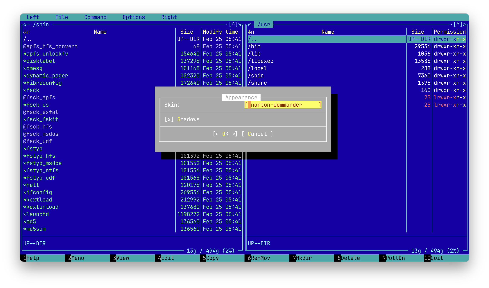

#### Volkov Commander

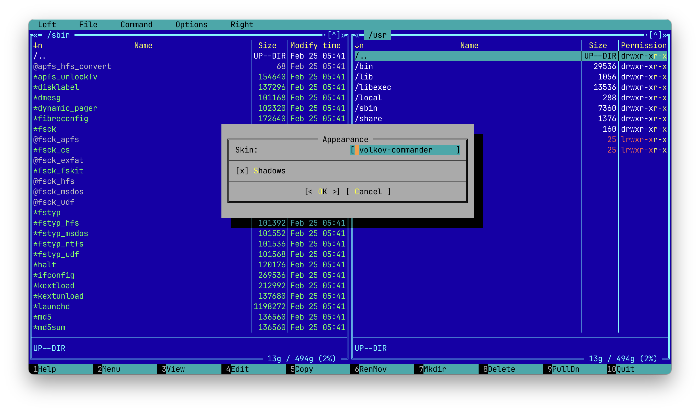

#### Far Manager

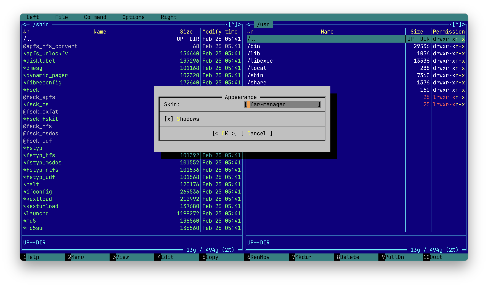

#### Dos Navigator

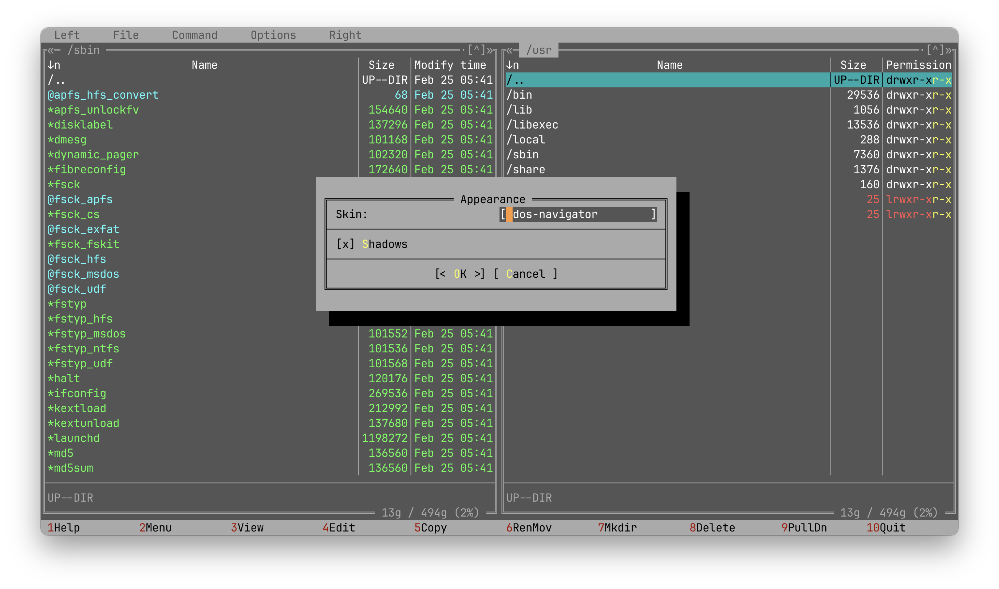

#### Turbo Pascal

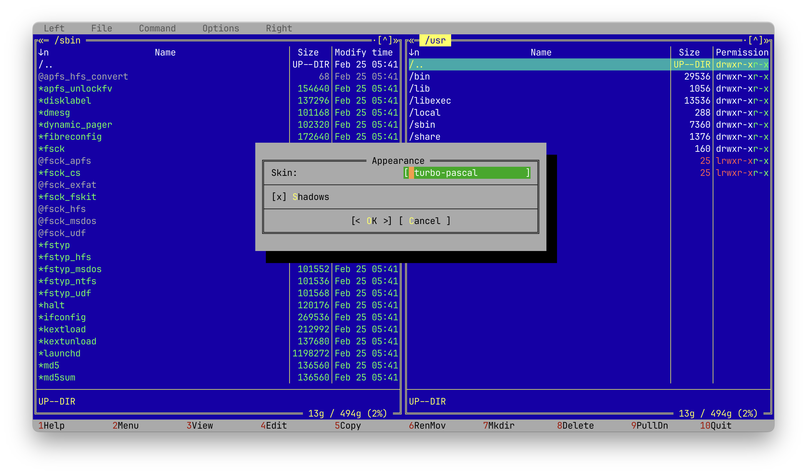

### Windows Themes

#### Total Commander

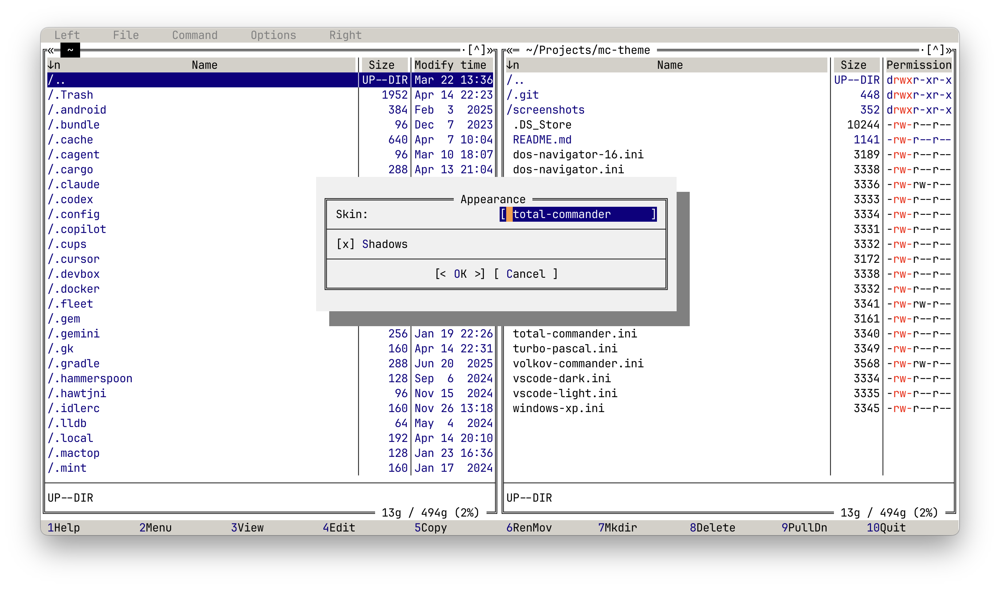

#### Windows XP

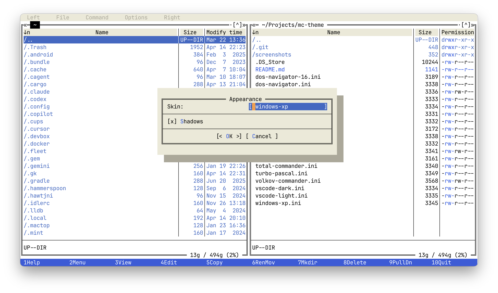

### macOS Themes

#### macOS Dark

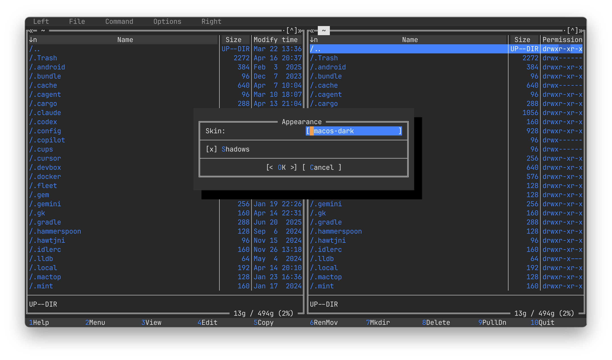

#### macOS Light

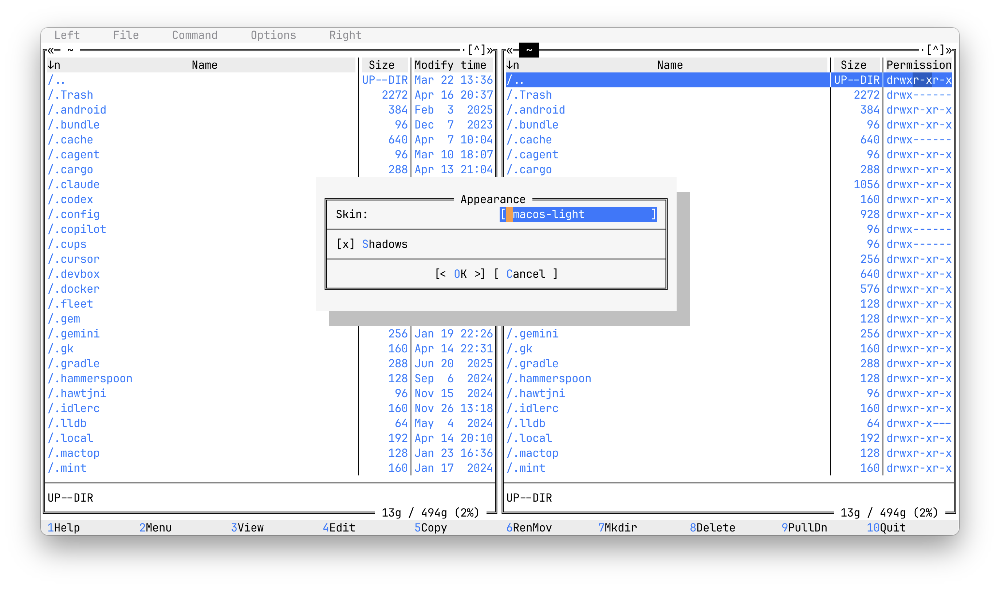

### Editor Themes

#### VS Code Dark+

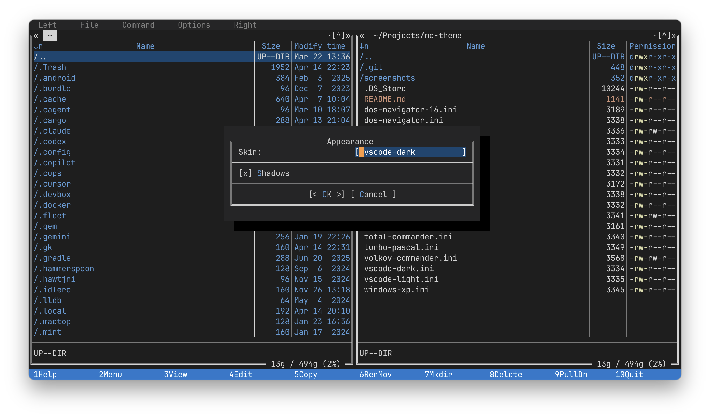

#### VS Code Light+

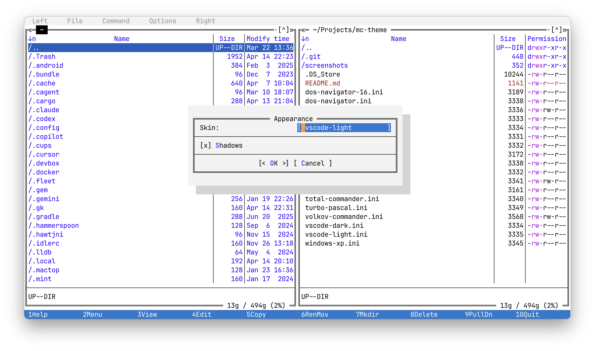

#### Monokai Pro

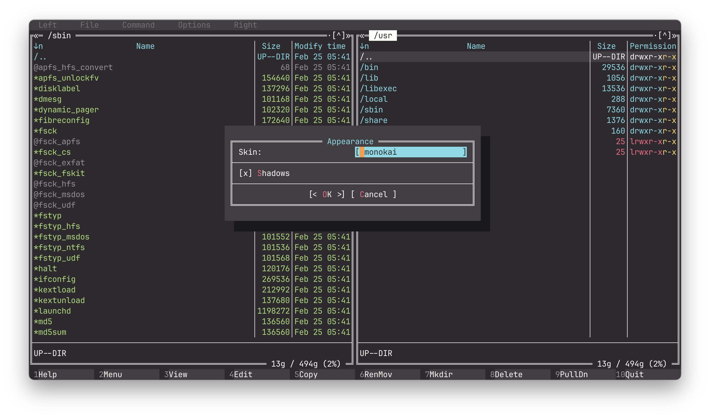

#### Monokai Pro Light

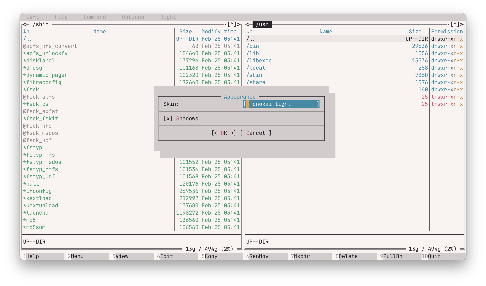

#### Gruvbox Dark

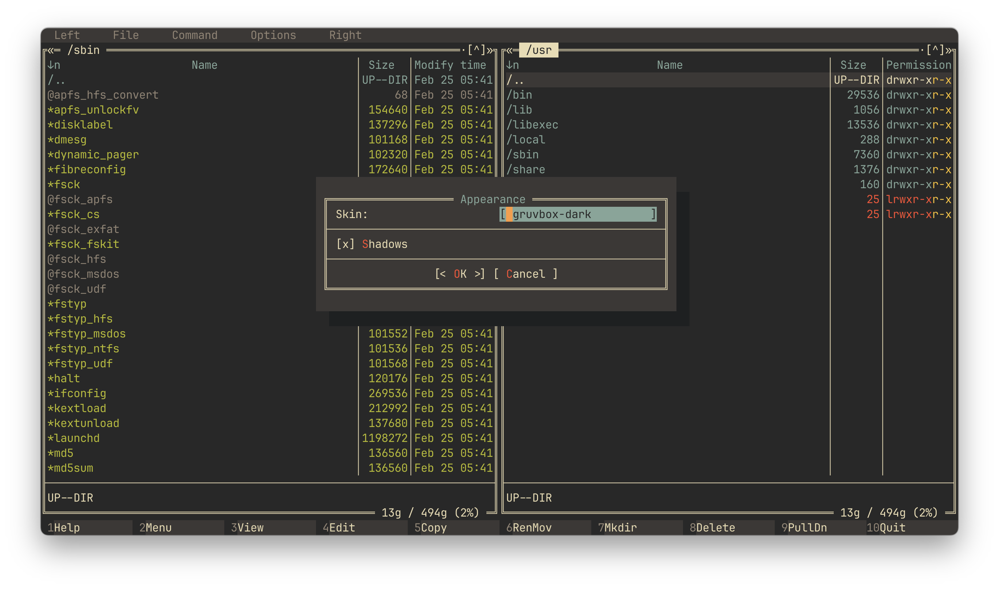

#### Gruvbox Light

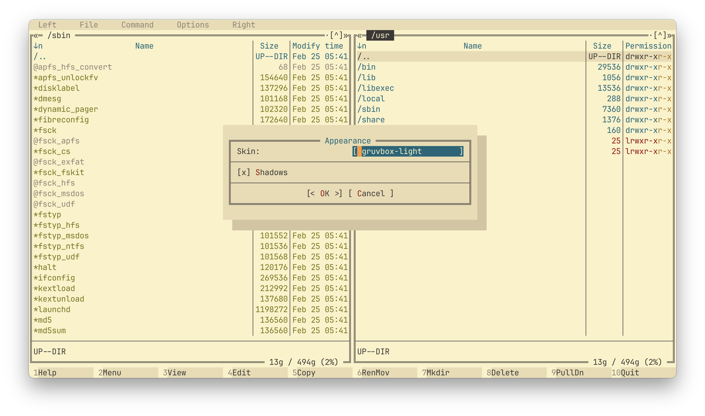

### Adaptive Themes

#### Mono (Dark)

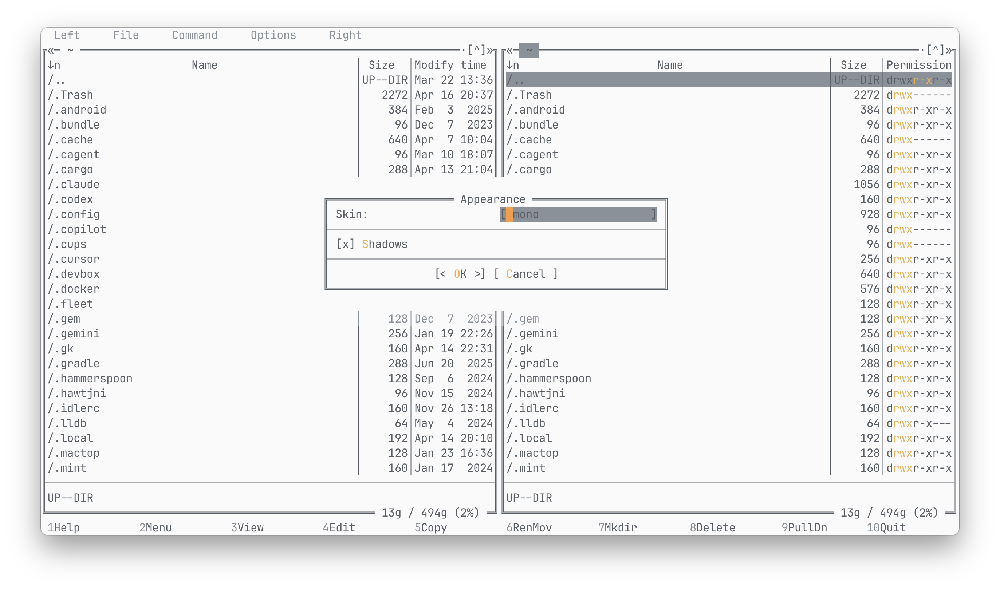

#### Mono (Light)

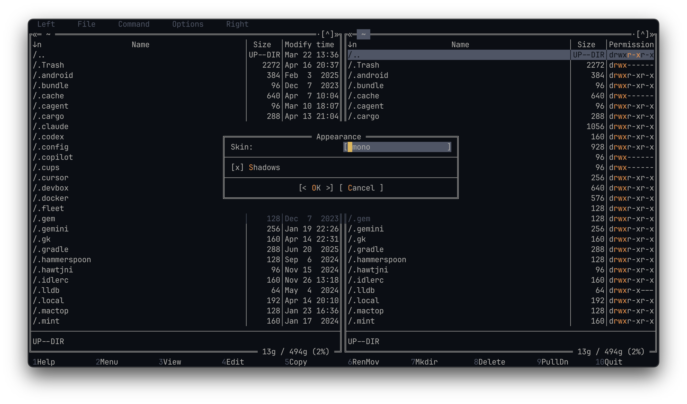

## License

MIT
